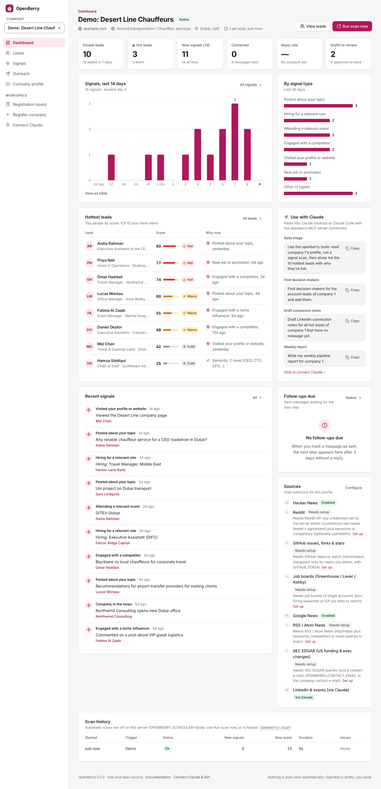
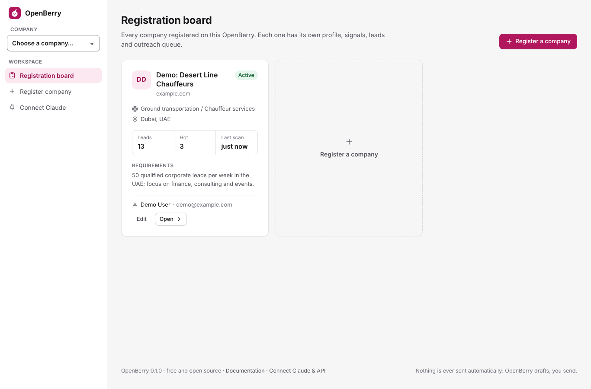
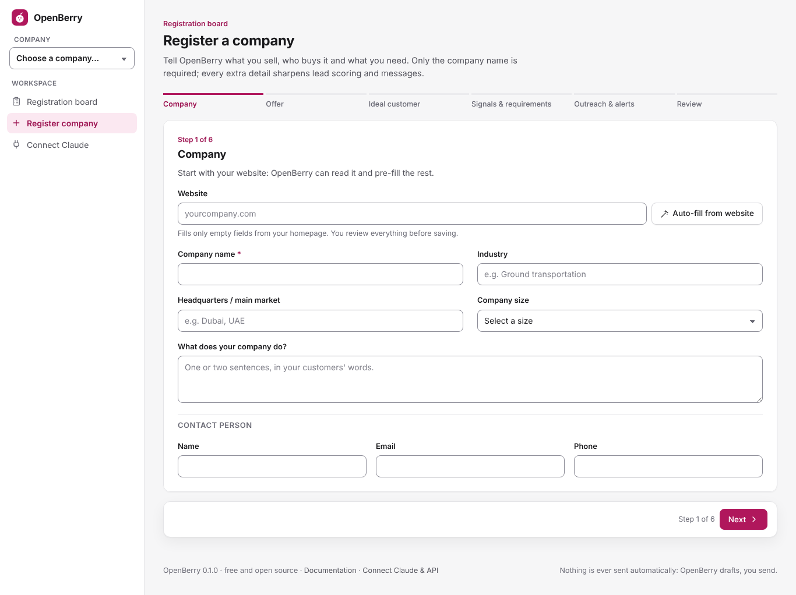
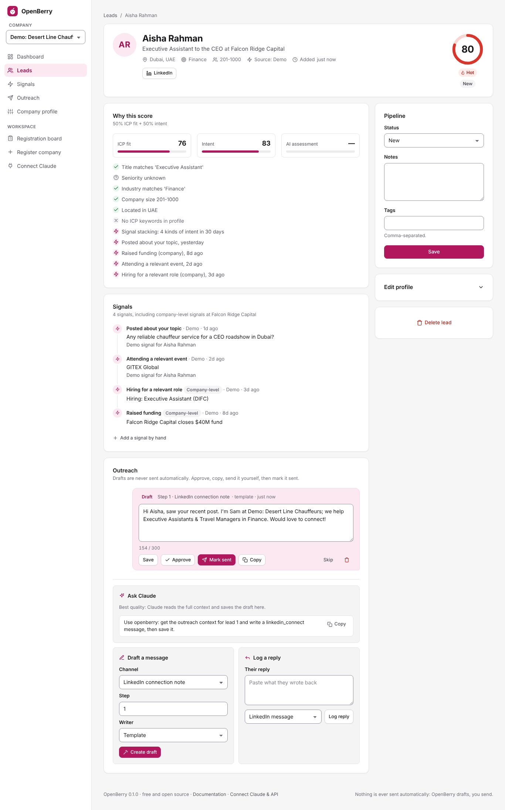

# 🍓 OpenBerry

**A free, self-hosted, open-source alternative to [Gojiberry](https://gojiberry.ai).** It finds warm B2B leads from
public intent signals, scores them against your ideal customer, and drafts personal outreach. Claude does the
thinking through MCP, and a web dashboard (with a registration board for your company details and requirements) keeps everything in one place.



## What it does

1. **Register your company** on the registration board: what you sell, who buys it (your ICP), which signals to watch,
   your requirements and your outreach style. It can auto-fill from your website.
2. **Collect intent signals** on a schedule from free public sources:
   - Hacker News, GitHub, Greenhouse/Lever/Ashby job boards, Google News, RSS and SEC EDGAR
   - Reddit, if you have API access
   - LinkedIn and anything else Claude can browse
3. **Score every lead** transparently: ICP fit + time-decayed intent + signal stacking, plus Claude's own judgement.
   Every point is explained ("Title matches 'Travel Manager'", "Hiring for a relevant role, 3d ago").
4. **Draft outreach** with Claude (or a free local Ollama model, or templates): LinkedIn notes, DMs, emails and follow-ups.
   **Nothing is ever sent automatically.** You review, copy, send and mark as sent.
5. **Alert you** on Slack or Discord when a person lead turns hot, whether a scan, Claude, the API, a CSV import or an edit
   made it hot. Alerts go out after each scan and, while `openberry serve` runs, within a few minutes.
   Export to CSV or use the JSON API with n8n or Activepieces.

| Registration board | Register a company | Lead detail |
|---|---|---|
|  |  |  |

See [docs/GOJIBERRY_COMPARISON.md](docs/GOJIBERRY_COMPARISON.md) for a feature-by-feature comparison.

## Quick start (5 minutes)

You need [uv](https://docs.astral.sh/uv/getting-started/installation/), a fast Python installer. Python 3.11+ is fetched automatically.

```bash
git clone https://github.com/connexionlimodubai-pixel/gj.git openberry && cd openberry
uv run openberry demo     # optional: a demo company with sample leads (all fictional)
uv run openberry serve    # → open http://127.0.0.1:8000
```

Click **Register company**, fill in the form, then **Run scan now** on your dashboard.
Data lives in `~/.openberry/openberry.db` (move it with `OPENBERRY_HOME` or `OPENBERRY_DB`).

### With Docker
```bash
cp .env.example .env      # set OPENBERRY_PASSWORD, OPENBERRY_SECRET_KEY and OPENBERRY_API_TOKEN if others can reach it
docker compose up -d      # → http://localhost:8000
```

## Connect Claude (the AI SDR)

Add OpenBerry to **Claude Desktop** (*Settings → Developer → Edit Config*):
```json
{
  "mcpServers": {
    "openberry": {
      "command": "uv",
      "args": ["--directory", "/ABSOLUTE/PATH/TO/openberry", "run", "openberry", "mcp"]
    }
  }
}
```
Claude Desktop doesn't always see your shell's `PATH`: if it can't start `uv`, put uv's full path (`which uv`) in `"command"`.
The dashboard's **Connect Claude** page (`/help`) shows the exact command and config for your install, Docker included.

For **Claude Code**: run `claude` inside this folder (the included `.mcp.json` registers the server), or run
`claude mcp add openberry -- uv --directory /ABSOLUTE/PATH/TO/openberry run openberry mcp`.

Then ask Claude things like:
- *"Set up OpenBerry for my company: read example.com, interview me, and register us."*
- *"Run today's lead hunt for company 1 and show me the 10 hottest leads with why."*
- *"Find the decision-makers at the companies that are hiring, and add them."*
- *"Draft LinkedIn connection notes for every hot lead that has no message yet."*

Claude gets 21 tools (scan, prospecting plan, add leads, assess, outreach context, save draft, log reply, pipeline report…),
plus prompts such as `daily_lead_hunt`. See [docs/CLAUDE_MCP.md](docs/CLAUDE_MCP.md).
To let Claude browse LinkedIn and the web too, add free open-source MCP servers next to OpenBerry
(Playwright, fetch, SearXNG, and optionally a LinkedIn MCP server at your own risk). See [docs/OPEN_SOURCE_STACK.md](docs/OPEN_SOURCE_STACK.md).

## Configuration

Everything is optional for local use. Put settings in `.env` (read from the current folder and `~/.openberry/.env`)
or in the environment. See [`.env.example`](.env.example) for the other settings.

| Variable | Purpose |
|---|---|
| `OPENBERRY_PASSWORD`, `OPENBERRY_SECRET_KEY` | Dashboard login. **Required** if anyone but you can reach the server. |
| `OPENBERRY_API_TOKEN` | Bearer token for `/api` and the HTTP MCP endpoint `/mcp` |
| `OPENBERRY_BASE_URL` | Public URL of the dashboard: links in Claude replies, an allowed host name, and Secure login cookies when it starts with `https://` |
| `OPENBERRY_ALLOWED_HOSTS` | Extra host names to answer to in local mode (no password), e.g. a LAN IP so `/mcp` works there |
| `OPENBERRY_PUBLIC_REGISTRATION=true` | Let clients fill in the registration form themselves (agency intake). Their companies wait, paused, for your review |
| `OPENBERRY_CONTACT_EMAIL` | Contact e-mail for SEC EDGAR's required User-Agent |
| `GITHUB_TOKEN` | Higher GitHub limits; stargazers of repos you admin |
| `REDDIT_CLIENT_ID`, `REDDIT_CLIENT_SECRET`, `REDDIT_USERNAME` | Optional Reddit source (see its terms) |
| `OPENBERRY_OLLAMA_URL`, `OPENBERRY_OLLAMA_MODEL` | Free local LLM: the "Local AI (Ollama)" writer in a lead's *Draft a message* card |
| `OPENBERRY_SCHEDULER=false` | Turn off automatic scans and the background hot-lead alerts |
| `OPENBERRY_HOME` | Data folder for `openberry.db` and the fallback `.env` (default `~/.openberry`). Environment only, not `.env` |
| `OPENBERRY_ENV_FILE` | Read settings only from this file instead of `./.env` and `~/.openberry/.env`. Environment only |

## Commands

```bash
openberry serve [--host 0.0.0.0 --port 8000]   # dashboard + /mcp + background scheduler
openberry mcp                                  # MCP over stdio (what Claude Desktop runs)
openberry mcp --http --port 8001               # standalone MCP over HTTP (bearer token)
openberry scan [--company 1] [--source hackernews]
openberry demo | rescore | init-db
```
(Prefix with `uv run` if you haven't installed it with `pip install .`.)
If you change `--host` or `--port`, set `OPENBERRY_BASE_URL` to the URL you open in the browser: Claude's links use it,
and without a password the server only answers to that host, `localhost` and IP addresses.

## How it works

```
Claude Desktop / Code ──MCP──▶ OpenBerry ◀── dashboard (registration board, leads, outreach)
        │                          │
        └─ optional MCP servers    ├─ collectors: HN · GitHub · job boards · News/RSS · SEC · Reddit
           (Playwright, fetch,     ├─ scoring: ICP fit + intent decay + signal stacking + Claude score
            LinkedIn, SearXNG)     └─ SQLite (~/.openberry/openberry.db)
```
More detail: [docs/ARCHITECTURE.md](docs/ARCHITECTURE.md) and [docs/SIGNALS.md](docs/SIGNALS.md).

## Responsible use

- OpenBerry never sends messages or automates LinkedIn. LinkedIn's User Agreement prohibits automation. If you add a
  LinkedIn MCP server, that is your decision and your account's risk.
- Each data source has terms. They are summarised in [docs/SIGNALS.md](docs/SIGNALS.md). Google News RSS is for personal,
  non-commercial use, and Reddit requires an agreement for commercial use.
- Prospect data is personal data. Comply with GDPR, the UAE PDPL, CAN-SPAM and similar laws: contact people with relevant, honest messages and
  honour opt-outs.

## Development

```bash
uv sync --extra dev
uv run pytest            # ~620 tests, no network needed
```

MIT licensed. Not affiliated with Gojiberry.
